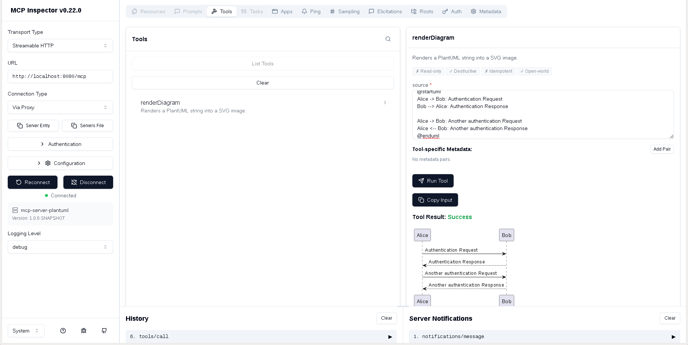

# MCP Server PlantUML

A Quarkus-based MCP server that renders PlantUML diagrams into SVG images.

## Requirements

- Java 25
- Gradle 9


## Running the application

The application can be packaged using:

```shell script
JAVA_HOME=<java 25 home>  ./gradlew quarkusRun
```


## Sample Output

The following screenshot shows the MCP Inspector interface with the `renderDiagram` tool being used to render a PlantUML sequence diagram:




